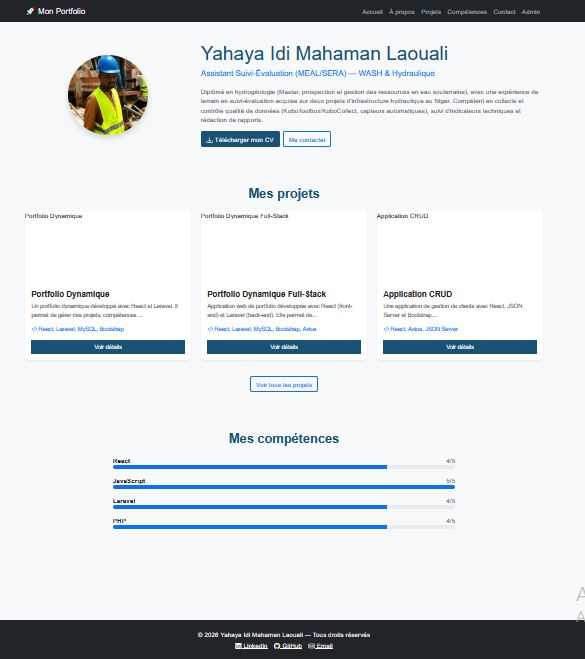
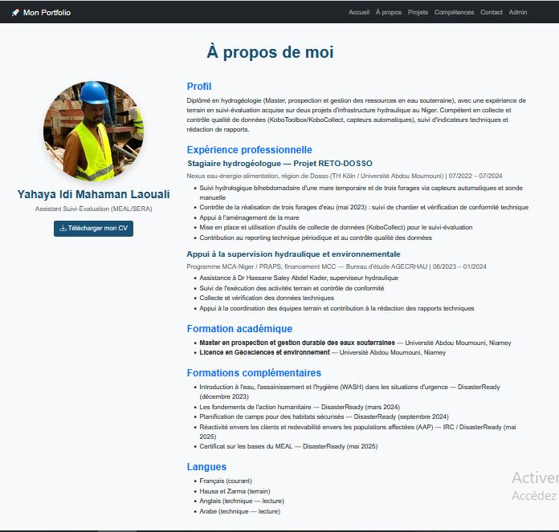
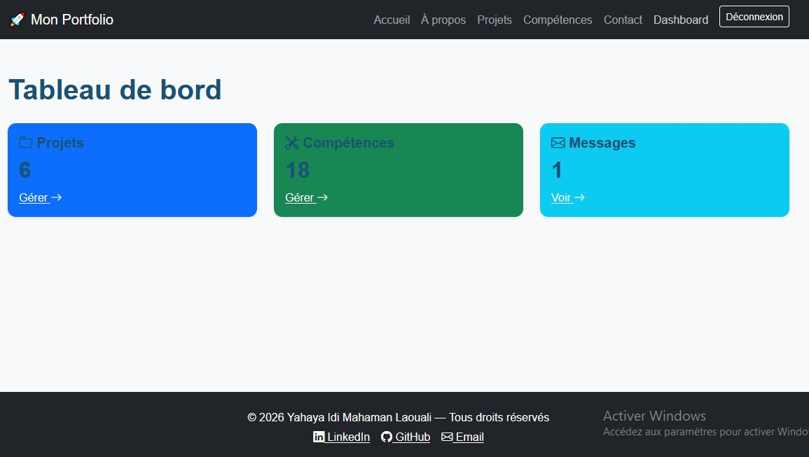

# 🚀 Portfolio Full-Stack React + Laravel

> Portfolio professionnel dynamique de **Yahaya Idi Mahaman Laouali**  
> Assistant Suivi-Évaluation (MEAL/SERA) — WASH & Hydraulique

[](https://react.dev)
[](https://laravel.com)
[](https://www.mysql.com)
[](https://getbootstrap.com)

---

## 📖 À propos du projet

Ce portfolio est une **application web full-stack** développée dans le cadre de la formation **D-CLIC (Développement Web Niveau Approfondi)** de l'OIF.

Il permet de présenter mon parcours professionnel en **hydrogéologie**, **WASH** et **Suivi-Évaluation (MEAL/SERA)**, tout en démontrant mes compétences en développement web moderne (React + Laravel).

L'application est **dynamique** : le contenu est géré depuis une **interface d'administration sécurisée**.

---

## ✨ Fonctionnalités

### 🌐 Espace public

- **Page d'accueil** : Présentation, photo de profil, projets récents, compétences
- **Page À propos** : Parcours détaillé, expériences, formations, CV téléchargeable
- **Liste des projets** : Affichage de tous les projets avec pagination
- **Détail d'un projet** : Description complète, technologies, liens
- **Compétences** : Affichage par catégorie avec barres de progression
- **Formulaire de contact** : Envoi de messages enregistrés en base

### 🔐 Espace administration

- **Authentification sécurisée** : Connexion via Laravel Sanctum
- **Tableau de bord** : Statistiques
- **CRUD Projets** : Ajouter, modifier, supprimer
- **CRUD Compétences** : Ajouter, modifier, supprimer
- **Gestion des messages** : Consulter et supprimer

---

## 🛠️ Stack technique

### Front-end (React)

| Technologie | Version | Rôle |
|-------------|---------|------|
| **React** | 18.3 | Bibliothèque UI |
| **Vite** | 5.x | Bundler |
| **React Router DOM** | 6.x | Navigation |
| **Axios** | 1.x | Requêtes HTTP |
| **Bootstrap** | 5.3 | Framework CSS |

### Back-end (Laravel)

| Technologie | Version | Rôle |
|-------------|---------|------|
| **Laravel** | 10.x | Framework PHP |
| **Laravel Sanctum** | 3.x | Authentification |
| **MySQL** | 8.0 | Base de données |

---

## 🚀 Installation

### Prérequis

- **PHP** >= 8.2
- **Composer** >= 2.x
- **Node.js** >= 18.x
- **MySQL** >= 8.0

### 📦 Étape 1 : Cloner le projet

```bash
git clone https://github.com/myahayaidi-cloud/portfolio-fullstack.git
cd portfolio-fullstack
```

### 🔧 Étape 2 : Back-end (Laravel)

```bash
cd backend
composer install
cp .env.example .env
php artisan key:generate
php artisan migrate
php artisan serve
```

### ⚛️ Étape 3 : Front-end (React)

```bash
cd frontend
npm install
npm run dev
```

---

## 🔑 Compte de test

| Rôle | Email | Mot de passe |
|------|-------|--------------|
| **Admin** | admin@portfolio.com | password123 |

---

## 📸 Captures d'écran

### Page d'accueil



### Page À propos



### Dashboard admin



---

## 👤 Auteur

**Yahaya Idi Mahaman Laouali**

- 🎓 Master en Hydrogéologie (Université Abdou Moumouni, Niamey)
- 💼 Assistant Suivi-Évaluation (MEAL/SERA) — WASH & Hydraulique
- 📧 Email : [myahayaidi@gmail.com](mailto:myahayaidi@gmail.com)
- 📱 Téléphone : +227 95 53 58 54
- 💼 LinkedIn : [Mon profil LinkedIn](https://linkedin.com/in/mahaman-laouali-yahaya-idi-913913331)
- 🐙 GitHub : [@myahayaidi-cloud](https://github.com/myahayaidi-cloud)

## 📄 Licence

Ce projet est sous licence **MIT**.